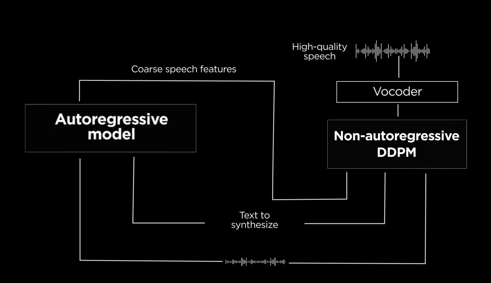

# MARS5: A novel speech model for insane prosody
<div id="top" align="center">

   

   <h3>
   <a href="https://www.loom.com/share/a6e7c6658f9f4b09a696926a98dd6fcc"> Why MARS5? </a> |
   <a href="https://github.com/Camb-ai/MARS5-TTS/blob/master/docs/architecture.md"> Model Architecture </a> |
   <a href="https://6b1a3a8e53ae.ngrok.app/"> Samples </a> |
   <a href="https://camb.ai/"> Camb AI Website </a></h3>

   [](https://github.com/Camb-ai/MARS5-TTS/stargazers)
   [](https://discord.gg/FFQNCSKSXX)
   [](https://huggingface.co/CAMB-AI/MARS5-TTS)
   [](https://colab.research.google.com/github/Camb-ai/mars5-tts/blob/master/mars5_demo.ipynb)


</div>

# Updates
<> July 5, 2024: Latest AR checkpoint released: higher stability of output. Very big update coming soon!


# Approach

This is the repo for the MARS5 English speech model (TTS) from CAMB.AI.

The model follows a two-stage AR-NAR pipeline with a distinctively novel NAR component (see more info in the [Architecture](docs/architecture.md)).

With just 5 seconds of audio and a snippet of text, MARS5 can generate speech even for prosodically hard and diverse scenarios like sports commentary, anime and more. Check out our demo:


https://github.com/Camb-ai/MARS5-TTS/assets/23717819/3e191508-e03c-4ff9-9b02-d73ae0ebefdd


Watch full video here: [](https://www.youtube.com/watch?v=bmJSLPYrKtE)



**Figure**: The high-level architecture flow of MARS5. Given text and a reference audio, coarse (L0) encodec speech features are obtained through an autoregressive transformer model. Then, the text, reference, and coarse features are refined in a multinomial DDPM model to produce the remaining encodec codebook values. The output of the DDPM is then vocoded to produce the final audio.

Because the model is trained on raw audio together with byte-pair-encoded text, it can be steered with things like punctuation and capitalization.
E.g. To add a pause, add a comma to that part in the transcript. Or, to emphasize a word, put it in capital letters in the transcript.
This enables a fairly natural way for guiding the prosody of the generated output.

Speaker identity is specified using an audio reference file between 2-12 seconds, with lengths around 6s giving optimal results.
Further, by providing the transcript of the reference, MARS5 enables one to do a '_deep clone_' which improves the quality of the cloning and output, at the cost of taking a bit longer to produce the audio.
For more details on this and other performance and model details, please see the [docs folder](docs/architecture.md).

## Quick links

- [CAMB.AI website](https://camb.ai/) (access MARS in 140+ languages for TTS and dubbing)
- Technical details and architecture: [in the docs folder](docs/architecture.md)
- Colab quickstart: [](https://colab.research.google.com/github/Camb-ai/mars5-tts/blob/master/mars5_demo.ipynb)
- Sample page with a few hard prosodic samples: [https://camb-ai.github.io/MARS5-TTS/](https://camb-ai.github.io/MARS5-TTS/)
- Online demo: [here](https://6b1a3a8e53ae.ngrok.app/)


## Quickstart


We use `torch.hub` to make loading the model easy -- no cloning of the repo needed. The steps to perform inference are simple:

1. **Installation using pip**:

    Requirements:
    - Python >= 3.10
    - Torch >= 2.0
    - Torchaudio
    - Librosa
    - Vocos
    - Encodec
    - safetensors
    - regex

```bash
pip install --upgrade torch torchaudio librosa vocos encodec safetensors regex
```

2. **Load models**: load the MARS5 AR and NAR model from torch hub:

```python
import torch, librosa

mars5, config_class = torch.hub.load('Camb-ai/mars5-tts', 'mars5_english', trust_repo=True)
# The `mars5` contains the AR and NAR model, as well as inference code.
# The `config_class` contains tunable inference config settings like temperature.
```

(Optional) Load Model from huggingface (make sure repository is cloned)
```python
from inference import Mars5TTS, InferenceConfig as config_class
import torch, librosa

mars5 = Mars5TTS.from_pretrained("CAMB-AI/MARS5-TTS")
```


3. **Pick a reference** and optionally its transcript:

```python
# Load reference audio between 1-12 seconds.
wav, sr = librosa.load('<path to arbitrary 24kHz waveform>.wav',
                       sr=mars5.sr, mono=True)
wav = torch.from_numpy(wav)
ref_transcript = "<transcript of the reference audio>"
```

*Note: The reference transcript is optional. Pass it if you wish to do a deep clone.*

MARS5 supports 2 kinds of inference: a shallow, fast inference whereby you do not need the transcript of the reference (we call this a _shallow clone_), and a second slower, but typically higher quality way, which we call a _deep clone_.
To use the deep clone, you need the prompt transcript. See the [model architecture](docs/architecture.md) for more info on this.

4. **Perform the synthesis**:

```python
# Pick whether you want a deep or shallow clone. Set to False if you don't know prompt transcript or want fast inference. Set to True if you know transcript and want highest quality.
deep_clone = True
# Below you can tune other inference settings, like top_k, temperature, top_p, etc...
cfg = config_class(deep_clone=deep_clone, rep_penalty_window=100,
                      top_k=100, temperature=0.7, freq_penalty=3)

ar_codes, output_audio = mars5.tts("The quick brown rat.", wav,
          ref_transcript,
          cfg=cfg)
# output_audio is (T,) shape float tensor corresponding to the 24kHz output audio.
```

**That's it!** These default settings provide pretty good results, but feel free to tune the inference settings to optimize the output for your particular usecase. See the [`InferenceConfig`](inference.py) code or the demo notebook for info and docs on all the different inference settings.

_Some tips for best quality:_
- Make sure reference audio is clean and between 1 second and 12 seconds.
- Use deep clone and provide an accurate transcript for the reference.
- Use proper punctuation -- the model can be guided and made better or worse with proper use of punctuation and capitalization.

## Or Use Docker

**Pull from DockerHub**

You can directly pull the docker image from our [DockerHub page](https://hub.docker.com/r/cambai/mars5ttsimage).


**Build On Your Own**

You can build a custom image from the provided Dockerfile in this repo by running the following command.

```bash
cd MARS5-TTS
docker build -t mars5ttsimage ./docker
```


*Note: This image should be used as a base image on top of which you can add your custom inference script in a Dockerfile or docker-compose. Images that directly generate output will be added to Docker Hub and as Dockerfiles in this repo soon*

## Model Details

**Checkpoints**

The checkpoints for MARS5 are provided under the releases tab of this github repo. We provide two checkpoints:

- AR fp16 checkpoint [~750M parameters], along with config embedded in the checkpoint.
- NAR fp16 checkpoint [~450M parameters], along with config embedded in the checkpoint.
- The byte-pair encoding tokenizer used for the L0 encodec codes and the English text is embedded in each checkpoint under the `'vocab'` key, and follows roughly the same format of a saved minbpe tokenizer.

The checkpoints are provided as both pytorch `.pt` checkpoints, and safetensors `.safetensors` checkpoints. By default, the `torch.hub.load()` loads the safetensors version, but you can specify which version of checkpoint you prefer with the `ckpt_format='safetensors'` or `ckpt_format='pt'` argument the in `torch.hub.load()` call. E.g. to force safetensors format:

`torch.hub.load('Camb-ai/mars5-tts', 'mars5_english', ckpt_format='safetensors')`

Or to force pytorch `.pt` format when loading the checkpoints:

`torch.hub.load('Camb-ai/mars5-tts', 'mars5_english', ckpt_format='pt')`

**Hardware Requirements**:

You must be able to store at least 750M+450M params on GPU, and do inference with 750M of active parameters.

If you do not have the necessary hardware requirements and just want to use MARS5 in your applications, you can use it via our [API](https://docs.camb.ai/). If you need some extra credits to test it for your use case, feel free to reach out to `help@camb.ai`.

## Roadmap and tasks

MARS5 is not perfect at the moment, and we are working on improving its quality, stability, and performance.
Rough areas we are looking to improve, and welcome any contributions in:

- Improving inference stability and consistency 
- Speed/performance optimizations 
- Improving reference audio selection when given long references.
- Benchmark performance numbers for MARS5 on standard speech datasets.

**Specific tasks**

- [ ] Profile the GPU and CPU memory and runtime speed metrics of the current model, add to readme.
- [ ] Port model operations not supported by MPS to equivalents to speed up apple mac inference. E.g. `site-packages/torch/nn/functional.py:4840: UserWarning: The operator 'aten::col2im' is not currently supported on the MPS backend and will fall back to run on the CPU. This may have performance implications`.
- [ ] Cleanly add more performant ODE samplers to DDPM inference code (even just DPM++2M would be great).
- [ ] Make demo/ user-interface program to rapidly collect human preference ratings between two audio samples, one generated by the model, and one ground truth.
- [ ] Implement a way to do long-form generation. E.g. one possibility is to chunk long intput text into smaller pieces and then synthesize the codes each in turn, concatenating them, and vocoding the final result.
- [ ] Perform a search (e.g. beam or grid) on the autoregressive sampling settings to find the setting preset which give the best quality.

If you would like to contribute any improvement to MARS5, please feel free to contribute (guidelines below).


## Contributions

We welcome any contributions to improving the model. As you may find when experimenting, it can produce really great results, it can still be further improved to create excellent outputs _consistently_.
We'd also love to see how you used MARS5 in different scenarios, please use the [🙌 Show and tell](https://github.com/Camb-ai/MARS5-TTS/discussions/categories/show-and-tell) category in Discussions to share your examples.

**Contribution format**:

The preferred way to contribute to our repo is to fork the [master repository](https://github.com/Camb-ai/mars5-tts) on GitHub:

1. Fork the repo on github
2. Clone the repo, set upstream as this repo: `git remote add upstream git@github.com:Camb-ai/mars5-tts.git`
3. Make a new local branch and make your changes, commit changes.
4. Push changes to new upstream branch: `git push --set-upstream origin <NAME-NEW-BRANCH>`
5. On github, go to your fork and click 'Pull Request' to begin the PR process. Please make sure to include a description of what you did/fixed.

## License

We are open-sourcing MARS5 in English under GNU AGPL 3.0. For commercial inquiries or to license the closed source version of MARS, please email help@camb.ai

## Join Our Team

We're an ambitious team, globally distributed, with a singular aim of making everyone's voice count. At CAMB.AI, we're a research team of Interspeech-published, Carnegie Mellon, ex-Siri engineers and we're looking for you to join our team.

We're actively hiring; please drop us an email at ack@camb.ai if you're interested. Visit our [careers page](https://www.camb.ai/careers) for more info.


## Community

Join CAMB.AI community on [Forum](https://github.com/Camb-ai/MARS5-TTS/discussions) and
[Discord](https://discord.gg/FFQNCSKSXX) to share any suggestions, feedback, or questions with our team.


## Support Camb.ai on Ko-fi ❤️!
[](https://ko-fi.com/cambai)


## Acknowledgements

Parts of code for this project are adapted from the following repositories -- please make sure to check them out! Thank you to the authors of:

- AWS: For providing much needed compute resources (NVIDIA H100s) to enable training of the model.
- TransFusion: [https://github.com/RF5/transfusion-asr](https://github.com/RF5/transfusion-asr)
- Multinomial diffusion: [https://github.com/ehoogeboom/multinomial_diffusion](https://github.com/ehoogeboom/multinomial_diffusion)
- Mistral-src: [https://github.com/mistralai/mistral-src](https://github.com/mistralai/mistral-src)
- minbpe: [https://github.com/karpathy/minbpe](https://github.com/karpathy/minbpe)
- gemelo-ai's encodec Vocos: [https://github.com/gemelo-ai/vocos](https://github.com/gemelo-ai/vocos)
- librosa for their `.trim()` code: [https://librosa.org/doc/main/generated/librosa.effects.trim.html](https://librosa.org/doc/main/generated/librosa.effects.trim.html)
