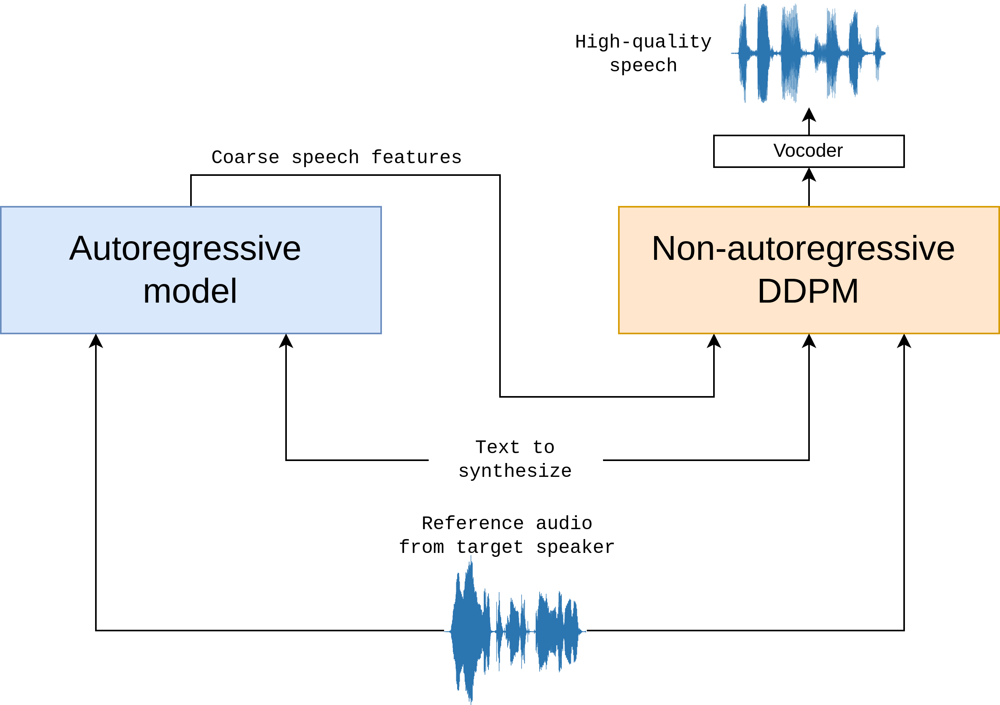

# MARS5: A novel speech model for insane prosody.

This is the repo for the MARS5 English speech model (TTS) from CAMB.AI.

The model follows a two-stage AR-NAR pipeline with a distinctively novel NAR component (see more info in the [docs](docs/architecture.md)). 

With just 5 seconds of audio and a snippet of text, MARS5 can generate speech even for prosodically hard and diverse scenarios like sports commentary, anime and more. Check out our demo:


**Quick links**:
- [CAMB.AI website](https://camb.ai/) (access MARS5 in 140+ lanugages for TTS and dubbing)
- Technical docs: [in the docs folder](docs/architecture.md)
- Colab quickstart: <a target="_blank" href="https://colab.research.google.com/github/Camb-ai/mars5-tts/blob/master/mars5_demo.ipynb"></a>
- Demo page with samples: [here](https://179c54d254f7.ngrok.app/)



**Figure**: the high-level architecture flow of Mars 5. Given text and a reference audio, coarse (L0) encodec speech features are obtained through an autoregressive transformer model. Then, the text, reference, and coarse features are refined in a multinomial DDPM model to produce the remaining encodec codebook values. The output of the DDPM is then vocoded to produce the final audio.

Because the model is trained on raw audio together with byte-pair-encoded text, it can be steered with things like punctuation and captialization.
E.g. to add a pause, add a comma to that part in the transcript. Or, to emphasize a word, put it in captial letters in the transcript. 
This enables a fairly natural way for guiding the prosody of the generated output.

Speaker identity is specified using an audio reference file between 2-12 seconds, with lengths around 6s giving optimal results.
Further, by providing the transcript of the reference, MARS5 enables one to do a '_deep clone_' which improves the quality of the cloning and output, at the cost of taking a bit longer to produce the audio.
For more details on this and other performance and model details, please see inside the [docs folder](docs/architecture.md).


## Quickstart


We use `torch.hub` to make loading the model easy -- no cloning of the repo needed. The steps to perform inference are simple:

1. **Install pip dependancies**: we have 3 inference dependencies only `torch`, `torchaudio`, `librosa`, `vocos`, and `encodec`. Python must be at version 3.10 or greater, and torch must be v2.0 or greater.

```bash
pip install --upgrade torch torchaudio librosa vocos encodec
```

2. **Load models**: load the Mars 5 AR and NAR model from torch hub:

```python
import torch, librosa

mars5, config_class = torch.hub.load('Camb-ai/mars5-tts', 'mars5_english', trust_repo=True)
# The `mars5` contains the AR and NAR model, as well as inference code.
# The `config_class` contains tunable inference config settings like temperature.
```
3. **Pick a reference** and optionally its transcript:

```python
# load reference audio between 1-12 seconds.
wav, sr = librosa.load('<path to arbitrary 24kHz waveform>.wav', 
                       sr=mars5.sr, mono=True)
wav = torch.from_numpy(wav)
ref_transcript = "<transcript of the reference audio>"
```

The reference transcript is an optional piece of info you need if you wish to do a deep clone.
Mars5 supports 2 kinds of inference: a shallow, fast inference whereby you do not need the transcript of the reference (we call this a _shallow clone_), and a second slower, but typically higher quality way, which we call a _deep clone_.
To use the deep clone, you need the prompt transcript. See the [model docs](docs/architecture.md) for more info on this. 

4. **Perform the synthesis**:

```python
# Pick whether you want a deep or shallow clone. Set to False if you don't know prompt transcript or want fast inference. Set to True if you know transcript and want highest quality.
deep_clone = True 
# Below you can tune other inference settings, like top_k, temperature, top_p, etc...
cfg = config_class(deep_clone=deep_clone, rep_penalty_window=100,
                      top_k=100, temperature=0.7, freq_penalty=3)

ar_codes, output_audio = mars5.tts("The quick brown rat.", wav, 
          ref_transcript,
          cfg=cfg)
# output_audio is (T,) shape float tensor corresponding to the 24kHz output audio.
```

That's it! These default settings provide pretty good results, but feel free to tune the inference settings to optimize the output for your particular example. See the [`InferenceConfig`](inference.py) code or the demo notebook for info and docs on all the different inference settings.

_Some tips for best quality:_
- Make sure reference audio is clean and between 1 second and 12 seconds.
- Use deep clone and provide an accurate transcript for the reference.
- Use proper punctuation -- the model is can be guided and made better or worse with proper use of punctuation and capitalization.


## Model details

**Checkpoints**

The checkpoints for MARS5 are provided under the releases tab of this github repo. We provide two checkpoints:

- AR fp16 checkpoint [~750M parameters], along with config embedded in the checkpoint.
- NAR fp16 checkpoint [~450M parameters], along with config embedded in the checkpoint.
- The byte-pair encoding tokenizer used for the L0 encodec codes and the English text is embedded in each checkpoint under the `'vocab'` key, and follows roughly the same format of a saved minbpe tokenizer. 

**Hardware requirements**:

You must be able to store at least 750M+450M params on GPU, and do inference with 750M of active parameters. In general, at least **20GB of GPU VRAM** is needed to run the model on GPU (we plan to further optimize this in the future).

If you do not have the necessary hardware requirements and just want to use MARS5 in your applications, you can use it via our API: see [docs.camb.ai](https://docs.camb.ai/). If you need some more credits to test it for your use case, feel free to reach out to `help@camb.ai` for help.

## Roadmap

Mars 5 is not perfect at the moment, and we are working on a few efforts to improve its quality, stability, and performance. 
Rough areas we are looking to improve, and welcome any contributions:

- Improving inference stability and consistency
- Speed/performance optimizations
- Improving reference audio selection when given long references.
- 
- Benchmark performance numbers for Mars 5 on standard speech datasets. 

If you would like to contribute any improvement to MARS, please feel free to contribute (guidelins below).

## Contributions

We welcome any contributions to improving the model. As you may find when experimenting, it can produce really great results, it can still be further improved to create excellent outputs _consistently_. 

**Contribution format**:

The preferred way to contribute to our repo is to fork the [master repository](https://github.com/Camb-ai/mars5-tts) on GitHub:

1. Fork the repo on github
2. Clone the repo, set upstream as this repo: `git remote add upstream git@github.com:Camb-ai/mars5-tts.git`
3. Make to a new local branch and make your changes, commit changes.
4. Push changes to new upstream branch: `git push --set-upstream origin <NAME-NEW-BRANCH>`
5. On github, go to your fork and click 'Pull request' to begin the PR process. Please make sure to include a description of what you did/fixed.

## License

We are open-sourcing MARS in English under GNU AGPL 3.0, but you can request to use it under a different license by emailing help@camb.ai

## Join our team

We're an ambitious team, globally distributed, with a singular aim of making everyone's voice count. At CAMB.AI, we're a research team of Interspeech-published, Carnegie Mellon, ex-Siri engineers and we're looking for you to join our team. 

We're actively hiring; please drop us an email at ack@camb.ai if you're interested. Visit our [careers page](https://www.camb.ai/careers) for more info. at 

## Acknowledgements

Parts of code for this project are adapted from the following repositories -- please make sure to check them out! Thank you to the authors of:

- AWS: For providing much needed compute resources (NVIDIA H100s) to enable training of the model.
- TransFusion: [https://github.com/RF5/transfusion-asr](https://github.com/RF5/transfusion-asr)
- Multinormial diffusion: [https://github.com/ehoogeboom/multinomial_diffusion](https://github.com/ehoogeboom/multinomial_diffusion)
- Mistral-src: [https://github.com/mistralai/mistral-src](https://github.com/mistralai/mistral-src)
- minbpe: [https://github.com/karpathy/minbpe](https://github.com/karpathy/minbpe)
- gemalo-ai's encodec Vocos: [https://github.com/gemelo-ai/vocos](https://github.com/gemelo-ai/vocos)
- librosa for their `.trim()` code: [https://librosa.org/doc/main/generated/librosa.effects.trim.html](https://librosa.org/doc/main/generated/librosa.effects.trim.html)
